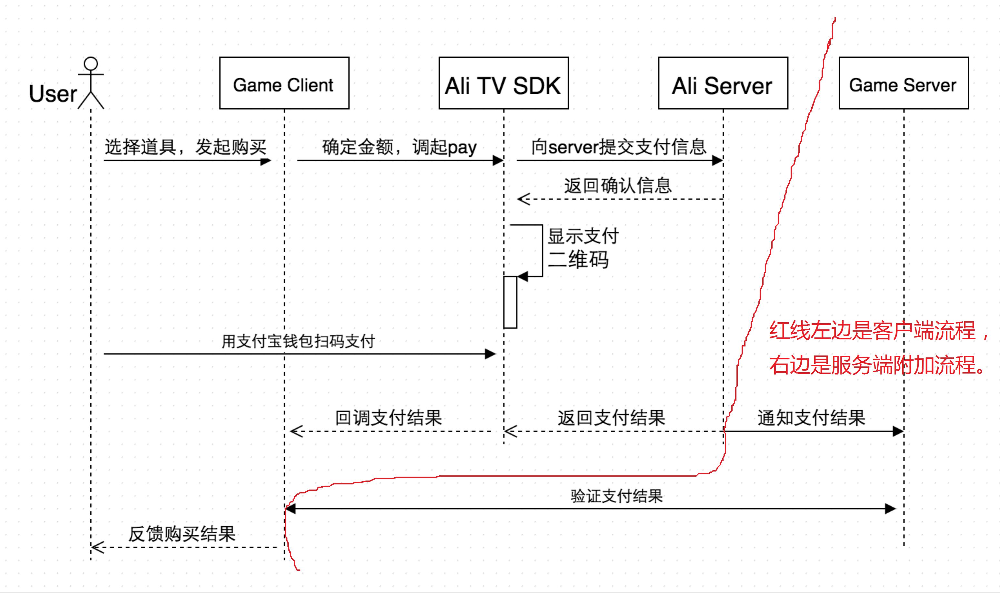

# 支付流程

## 背景知识

通常，购买一个商品的完整流程分为*询价*、*下单*、*支付*和*发货*。但本节的支付流程只讨论后三个环节。

遵循游戏行业的惯例，本节的支付流程是主要指在游戏中购买钻石，即**充值**。虽然游戏内还可以用钻石来购买道具，但这已经与平台无关了。

阿里电视游戏平台自动将法定货币（人民币）兑换为平台虚拟货币（**宝点**，1 宝点等值于人民币 1 分钱），开发者只需要在购买流程中发起宝点支付，并在扣款后发放钻石（发货）。支付口的 `amount` 参数就是指以宝点（人民币分）为单位的客单价， `title` 参数则是指客单描述，会显示在支付宝钱包的账单中。

> **客单价**是指订单的总价（客单价 = 商品定价 x 商品数量）。从广义角度讲，商品定价由*货币*、*单位*和*数量*三部分组成。货币分为*法定货币*（如人民币）、*虚拟货币*和*积分*。虚拟货币又可分为*平台币*（如腾讯的 Q 币和阿里游戏的宝点）和*游戏币*（如莉莉丝《刀塔传奇》中的宝石）。按《[文化部49号令](http://www.gov.cn/flfg/2010-06/22/content_1633935.htm)》推导，积分和虚拟货币的区别是，积分不能用法定货币直接或间接购买。

> **发货**是指根据完成的客单来修改游戏数据，如给玩家背包里增加 100 个钻石。

只要支付完成，游戏客户端就会收到 SDK 回调。游戏有服务端的话，服务端也需要收到 HTTP  回调（由支付接口控制）。但是，**在哪个回调里发货，是跟游戏架构相关的。**

> 单机游戏与网络游戏的本质区别在于游戏数据（背包、进度等）存储在客户端还是服务端。如果游戏数据存在客户端，却有个网络服务来管理订单，那么，这个游戏归根结底还是个单机游戏，或者说，它是一个有网络商店的单机游戏。

**单机游戏**显然在客户端回调中发货。

**有网络商店的单机游戏**，需要先在其商店服务中创建订单，再发起平台购买流程，商店服务接收 HTTP 回调完成该订单，游戏客户端则确认该订单完成后再发货。也就是说，这个网络商店需要提供另一套回调机制，游戏应该忽略 SDK 回调，而是在商店的客户端回调里发货。

**网络游戏**的订单同步部分同上，但是在服务端发货。网络游戏也要提供一套回调机制，游戏客户端应忽略 SDK 回调，而是从游戏服务端获取新数据，然后进行客户端渲染。

OK ，到此为止，我们可以知道，按有没有服务端接收 HTTP 扣款通知，可分为“客户端流程”和“客户端流程+服务端附加流程”两种情况。

游戏架构 | 支付接口 | 说明
---------|----------|--------
单机游戏 | pay      | 只有客户端流程
有网络商店的单机游戏 | payFromServer | 启用服务端附加流程
网络游戏 | payFromServer | 启用服务端附加流程



## 纯客户端流程接口

单机版只需要用 `pay(String title, long amount, PayListener listener)` 接口发起流程。

> 这个操作必须在 [SDK 初始化](bootstrap.md)完成后发起。

```java
    // int amount = 1;
	// String title = "支付人民币 0.01元";
    AliTvSdk.pay(title, amount,
		new IPayListener() {
			@Override
			public void onSuccess(String title, int amount) {
				// 发货
			}
			@Override
			public void onError(String title, int amount, String errMsg) {
				// 支付出错
			}
			@Override
			public void onCancel(String title, int amount) {
				// 取消支付
			}
});
```

## 支持服务端附加流程的客户端接口

由 `payFromServer( String title, long amount, String orderId, String notifyUrl)` 发起的流程与单机版的区别，是多了一些服务端同步的参数。

> 这个操作必须在 [SDK 初始化](bootstrap.md)完成后发起。

> 调用这个接口前需先在商店/游戏服务端创建订单，调用时将这个订单号传给 SDK ，平台服务器会在服务端附加流程中将该订单号透传给商店/游戏服务端。

```java
    // int amount = 2;
	// String title = "支付人民币 0.02元";
	// String orderId = 服务端产生的订单号
	// String notifyUrl = 服务端接收回调的 HTTP 地址，详见服务端附加流程。
    AliTvSdk.payFromServer(title, amount, orderId, notifyUrl, new IPayListener() {
        @Override
		public void onSuccess(String title, int amount) {
            // 轮询服务端，等其完成附加流程
            // 或者，发起实现相同功能的异步回调流程
		}
		@Override
		public void onError(String title, int amount, String errMsg) {
		    // 客户端流程报错，服务端附加流程一般不会启动
		}
		@Override
		public void onCancel(String title, int amount) {
		    // 客户端取消支付，服务端附加流程一般也不会启动
		}
    });
```

> 实际上，这里涉及分布式系统事务（即平台服务端和商店/游戏服务端共同构成一个大的分布式系统）。严格的分布式系统事务由两阶段提交协议完成，但其实现较复杂，通常的做法是，通过“补单”来订正数据。

## 服务端附加流程

只有 `payFromServer` 拉起并确认支付，才会启动服务端流程。平台服务器会向商店/游戏服务端发 HTTP GET 请求，通知后者完成订单，后者产生 拒收或者受理的 json 响应。在这个 HTTP 交互中，商店/游戏服务端的响应逻辑是：

> 交互参数请参考 [API 清单](../api/http.md)。这个逻辑有 [Java 参考实现](../appendix/serverdemo.md)。

```
if ( HTTP 参数不合法) {
    // 配置错误（宝点密钥填错了，或者有人在扫描系统）
    // 拒收通知
}
else {
    if (is_success 是字符串 T) {
        if (app_order_id 指定的订单有问题) {
            // 受理通知，但排查为什么出现这种状态
        } else {
            // 发货
            // 受理通知
        }
    }
    else {
        // 也受理该通知，但将透传过来的订单号标记为失败
    }
}
```

**若 HTTP 通知未受理，平台服务端会在 24 小时内多次重试。**

所谓的**受理**，就是回一个 body 为类似如下 json 的 HTTP 响应：

```
 {"is_success": "T",
  "app_order_id": "...",
  "coin_order_id": 0 }
```

> 注意，coin_order_id 值是数字，而不是字符串。

其中 `is_success` 表示是(`T`)否(`F`)受理该请求，另两个字段从请求中复制过来，除了调试外，没啥用。

